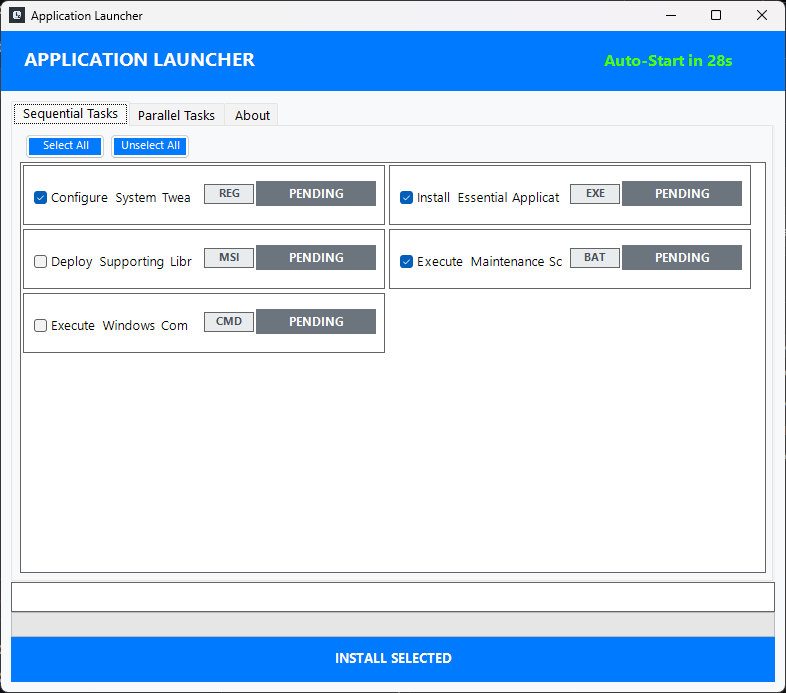

# Application Launcher (v1.2)


A powerful, modern, GUI-based application installer and script launcher built with PowerShell. This utility is designed to streamline system setup by allowing users to select and run a sequence of installers, registry tweaks, and scripts from a single, easy-to-use interface.

## Preview


<br>

## ✨ Features

* **Modern UI:** Clean, responsive, and easy-to-navigate Windows Forms interface.
* **Sequential & Parallel Execution:** Organize tasks into two tabs:
    * **Sequential:** Tasks run one after the other (ideal for dependencies, e.g., prerequisite installation).
    * **Parallel:** Tasks run concurrently (ideal for independent installations, e.g., common utility apps).
* **Automatic Administrator Elevation:** Uses a companion `.cmd` file to ensure the script runs with necessary permissions for system changes (like registry tweaks or silent installs).
* **Auto-Start Countdown:** An optional 30-second countdown to automatically start installation if the user is hands-off.
* **Dynamic Layout:** Task panels adjust dynamically to the application window size for clean, professional alignment.
* **Supports Multiple File Types:** Natively executes `.exe`, `.msi`, `.reg`, `.bat`, and `.cmd` files with configurable arguments.

## 💻 Requirements

* **Operating System:** Windows (PowerShell 5.1 or later).
* **Files:** All configuration and installer files must be placed within the script's root directory or subdirectories.

## ⚙️ Configuration

All tasks are defined in the `config.json` file in the root directory.

### `config.json` Structure

The file contains two main arrays: `sequential` and `parallel`. Each task object requires the following fields:

| Field | Type | Description |
| :--- | :--- | :--- |
| `name` | string | The name displayed in the GUI. |
| `file` | string | **Relative path** to the executable/file (e.g., `Installers\App.exe`). |
| `type` | string | The file extension (`exe`, `msi`, `reg`, `bat`, `cmd`). |
| `args` | string | **Optional.** Command line arguments for silent installation (e.g., `/S /qn`). Use `$null` or an empty string if not needed. |
| `selected` | boolean | `true` to select the task by default; `false` otherwise. |

**Example Task:**

```json
{
  "name": "Install Essential Application (EXE)",
  "file": "Installers\\Setup_Essential.exe",
  "type": "exe",
  "args": "/SILENT /NORESTART",
  "selected": true
}
```

## 🚀 Usage

* **Organize Files:** Place all your installer files (MSI, EXE, etc.) and configuration files (like config.json, ApplicationLuncher.ps1, and Application Launcher.cmd) into the same project folder. Create subfolders (e.g., Installers, Registry) as needed.

* **Edit config.json:** Modify config.json to define all your installation and script tasks.

* **Run the Launcher:** Double-click Application Launcher.cmd. This file ensures the PowerShell script runs with Administrator privileges.

* **Select Tasks:** Choose which tasks you want to run from the two tabs.

* **Start Installation:** Click the INSTALL SELECTED button (or wait for the 30-second countdown to auto-start).

***

## 🛑 Disclaimer and Project Status

This project is open-source and provided **"AS IS"** under the GPLv3 license.

As a personal, side project, I may not have the capacity to provide regular bug fixes, new feature updates, or dedicated support. **The community is encouraged to submit Pull Requests for maintenance and new features.**

***

***

## 🤖 AI Development Note

The core code logic, framework structure, and UI integration were developed, refined, and debugged by me with significant assistance from an AI coding assistant (Gemini). I am the final author and maintainer of the complete code.
***

## ❤️ Support the Project

This project is open-source and developed in my free time. If you find the **Application Launcher** useful, please consider supporting its development!

### Cryptocurrency Donations

| Coin | Address |
| :--- | :--- |
| **Bitcoin (BTC)** | `bc1q5l70mhm77sqst6r4tkvmwqx4lmr0fc6ex64enc`|
| **Ethereum (ETH)** | `0x9598F7cF3ee2dAad2a06b808980FD8182cC73311`|
| **Solana (SOL)** | `36CdEL4rdtqX6PQdx7eYejbVBaoBPt8xEh8u4qncX6ML`|
| **TRON (TRX)** | `TD9tPyd6DpinMnkiQBaXKxCcunCDQyvyFz`|
| **Toncoin (TON)** | `UQDb9vadr4Kd14dMtRcrOiZzYqAfT2MeOzcciUC1Sw_3XG69`|
